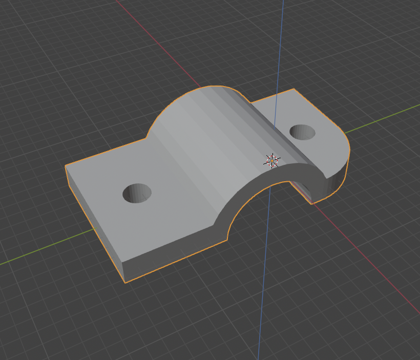

# Water level measurement
## Current Loop Sensor

- The ESP8266 creates an access point with a captive portal to which you can connect.
It can be connected to a WiFi-Network via the interface.
- The 8-stage LED display is also shown in the web interface and shows the measures level.
- Minimum and maximum values can be set.
- The direction of the LEDs can be reversed.
- The brightness of the LEDs in the housing can be adjusted in 7 levels.
- The measuring interval can be configured both via the hardware buttons and the web interface.

---

*Using transistors to control the step-up module for the power supply of the sensor.*

---

*Using controller board converter for the power supply of the sensor.*

---

**Used Parts:**

* **ESP8266** - [diymore NodeMCU V3](https://amzn.to/4kDgivv)
* **Sensor** - [TL-136 12-32VDC 4-20mA](https://amzn.to/43LIqXw)
* **Buttons** - [RUNCCI-YUN 20 pieces 3V-6V-12V-24V](https://amzn.to/3STD4TT)
* **LED Indicator** [Sparkleiot 8 Bits WS2812 RGB LED Stick](https://amzn.to/4dA574t)
* **Converter** - [CONTROLLED DC-DC STEP-UP CONVERTER](https://www.curiouselectric.co.uk/products/controlled-dc-dc-step-up-converter)

(Amazon affiliate links - if you want to support this project, use these links)

---

## LED menu control

**Buttons**  
- 🔴 **Red** - Activate / Confirm menu  
- ⚫️ **Black** - Change selection / values  

---

### Operation

1. **Open menu**  
   - Press the red button once  
   - 1. yellow LED lights up → menu activated, selection on point 1  

2. **Select and confirm items**  
   - Black button: Navigate through menu items or adjust values  
   - Red button: Activate selected item or save value  
   - Save: Purple LED animation  

3. **Menu items**  
   1. **Brightness of the LED display**  
   2. **Measurement interval**  
      - **6** = Permanent (1 second)  
      - **5** = 30 seconds  
      - **4** = 5 minutes  
      - **3** = 30 minutes  
      - **2** = 1 hour  
      - **1** = 4 hours  
   3. **Set minimum measured value**  
   4. **Set maximum measured value**  
   5. **Invert LED display**  
   6. **Reset all settings**
   7. **Restart**

---

> **Note:**  
> If no entry is made, the menu ends automatically after 15 seconds and displays the measured value again.

---

## Blender construction

## Finished assembly

---
### Contribution

- Thanks to the awesome Arduino community for helping me on my first steps for this project: [Thread](https://forum.arduino.cc/t/esp8266-arduino-wasserstand-sensor/1325364/28?_gl=1*1spmg4h*_up*MQ..*_ga*MjEyMzMxMjI2Ni4xNzQ2MzU2Mjg0*_ga_NEXN8H46L5*czE3NDYzNTYyODIkbzEkZzAkdDE3NDYzNTYyODIkajAkbDAkaDE2NTY4OTAwNjg.)
- Thanks for some inspiration on basic suggestions and for providing some code to read the current loop sensor: Werner Rothschopf - [Blogpost](https://werner.rothschopf.net/202009_arduino_stromschleifenschnittstelle_4mA_20mA.htm).

This Software and all its components is published under the [Beerware License](https://de.wikipedia.org/wiki/Beerware)

---

### License

"THE BEER-WARE LICENSE" (Revision 42):
[Daniel Kugler](mailto:daniel.kugler@neonsw.de) wrote this file. As long as you retain this notice you
can do whatever you want with this stuff. If we meet some day, and you think
this stuff is worth it, you can buy me a beer in return.

Daniel Kugler
